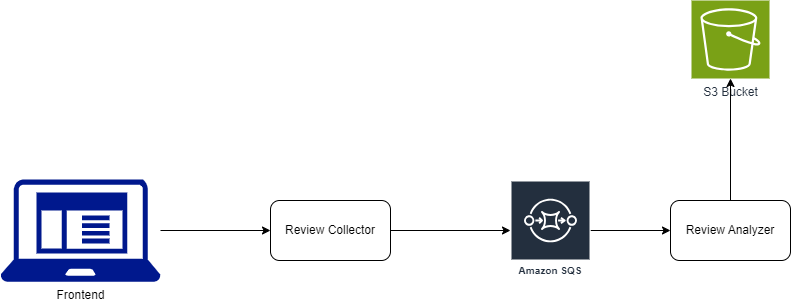

# Review Analysis Cloud Microservices - Test Containers and Localstack in practice

## Microservices 

* Review Collector
* Review Analyzer

## Stack

* Java 17
* Spring Boot
* Gradle
* Test Containers
* Localstack
* AWS (S3, SQS)

## Requirements to run it locally

[TODO]

## Instructions to run the project

[TODO]

## QA Strategy

* Unit Tests: <b>Junit5 and Mockito</b>
* Integration tests: <b>Spring Boot Test, TestContainers, Localstack</b> 
* Quality Metrics:
    * Mutation Tests/Mutation Coverage: <b>PITest</b>
    * Code Coverage: <b>Jacoco</b>
    * Technical Debt, Code Smells and other complementary metrics : <b>Sonar Cloud</b>
* Contract tests: <b>Pact framework</b>
* Continuous Integration: This project uses Github Action for Continuous Integration, where it executes all the tests and Sonar Cloud Analysis for every pull request, making easier the process of integration of every new code, also facilitating the process of Code Review.

## Pipeline configuration

[TODO]